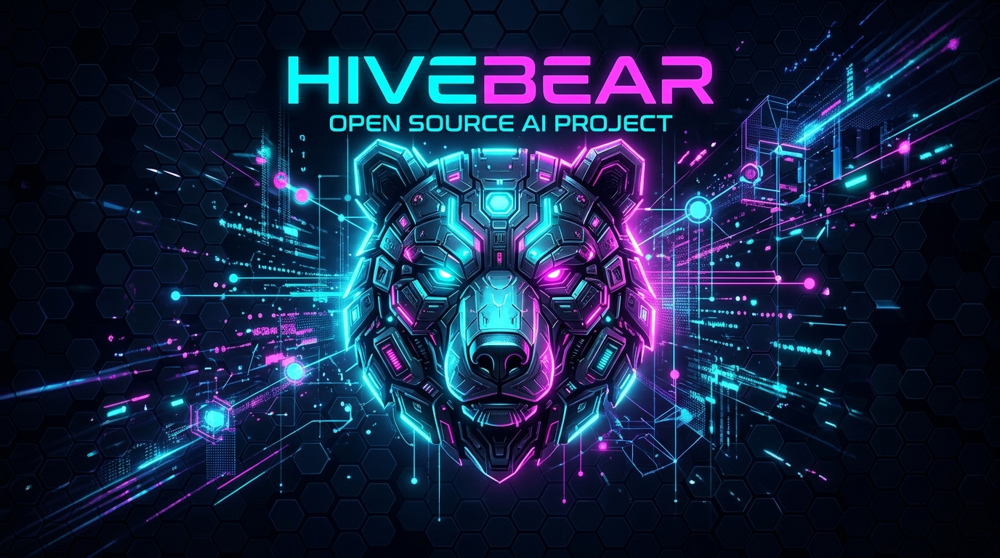

<p align="center">
  
</p>

<p align="center">
  <strong>The world's largest peer-to-peer AI mesh network & local runtime.</strong><br>
  <em>La red mesh P2P y entorno de ejecución local de IA más grande del mundo.</em><br>
  Every device is a node — from High-End GPUs to Laptops and Android devices with Termux.<br>
  <em>Patched, Enhanced & Maintained by <a href="https://github.com/kuromi04">@kuromi04</a></em>
</p>

<p align="center">
  <a href="https://github.com/kuromi04/TermuxHiveBear"></a>
  <a href="LICENSE"></a>
  
</p>

<p align="center">
  <a href="#english">🇬🇧 English</a> | <a href="#español">🇪🇸 Español</a>
</p>

---

<a name="english"></a>
## 🇬🇧 English Documentation

### 🛠️ Patches & Improvements in this Edition (by @kuromi04)
- 🚀 **hivebear-coordinator (P2P Signaling Server):** Dedicated, lightweight Rust HTTP server with Docker support to coordinate P2P mesh discovery, STUN hole-punching, and swarm matchmaking worldwide.
- 🛡️ **Cybersecurity Hardened:** Mitigated Denial-of-Service (DoS) and memory leak risks by bounding signal buffers (max 50 queue per peer) and cleaning inactive state.
- 📱 **Termux & Mobile Integration ([TermuxHiveBear](https://github.com/kuromi04/TermuxHiveBear)):** Seamlessly connect Android smartphones running Termux to your desktop AI mesh network.
- 📥 **HF Nested Path Download Fix:** Resolved `OS error 3` path errors when downloading HuggingFace models with subdirectories (`Q4_K_M/model.gguf`).
- ⚡ **Resilient Stream Downloads:** Added automatic reconnect and chunk resume logic with HTTP `Range` headers.
- 💬 **Chat Persistence:** Conversations persist across app restarts and tab navigation with SQLite.

---

### 🌐 Architecture

```
                               ┌─────────────────────────────────────────┐
                               │     HiveBear Coordination Server        │
                               │        (hivebear-coordinator)           │
                               │  https://your-vps.com:7879 / Docker     │
                               └──────────────────┬──────────────────────┘
                                                  │ Handshake & PEX
                      ┌───────────────────────────┴───────────────────────────┐
                      ▼                                                       ▼
       💻 Windows / Mac / Linux PC                             📱 Android Phone (TermuxHiveBear)
       (Runs Layers 1 to 40 of 70B Model)                       (Runs Layers 41 to 60 or Draft Model)
                      ▲                                                       ▲
                      └───────────── Direct P2P Encrypted QUIC Stream ────────┘
```

---

### ⚡ 1-Line Universal Dependency Installer

Before building, install all required dependencies automatically:

- **Linux / Android (Termux) / macOS:**
  ```bash
  curl -fsSL https://raw.githubusercontent.com/kuromi04/HiveBear/main/scripts/setup.sh | bash
  ```
- **Windows (PowerShell as Administrator):**
  ```powershell
  irm https://raw.githubusercontent.com/kuromi04/HiveBear/main/scripts/setup.ps1 | iex
  ```

---

### 🖥️ Platform-Specific Setup Guide

#### 📱 Android (Termux)
> ⚠️ **IMPORTANT:** Never install Termux from Google Play or F-Droid! Always use the official releases from the [official Termux GitHub repository](https://github.com/termux/termux-app/releases).

1. Download and install the latest APK (`termux-app_..._universal.apk`) from [termux-app releases](https://github.com/termux/termux-app/releases).
2. Open Termux and run the auto-installer:
   ```bash
   curl -fsSL https://raw.githubusercontent.com/kuromi04/HiveBear/main/scripts/setup.sh | bash
   ```
3. Clone and run [TermuxHiveBear](https://github.com/kuromi04/TermuxHiveBear):
   ```bash
   git clone https://github.com/kuromi04/TermuxHiveBear.git
   cd TermuxHiveBear
   cargo build --release
   ./target/release/hivebear contribute --coordinator http://YOUR-VPS-IP:7879 --port 7878
   ```

#### 🐧 Linux (Ubuntu / Debian / Fedora / Arch)
1. Install dependencies:
   ```bash
   curl -fsSL https://raw.githubusercontent.com/kuromi04/HiveBear/main/scripts/setup.sh | bash
   ```
2. Build Desktop application:
   ```bash
   git clone https://github.com/kuromi04/HiveBear.git
   cd HiveBear/apps/desktop
   npm install
   npx @tauri-apps/cli build
   ```
3. AppImage/deb will be in `target/release/bundle/`.

#### 🪟 Windows (10 / 11)
1. In PowerShell:
   ```powershell
   git clone https://github.com/kuromi04/HiveBear.git
   cd HiveBear\apps\desktop
   npm install
   npx @tauri-apps/cli build
   ```
2. The setup installer will be generated at:
   `target/release/bundle/nsis/HiveBear_0.2.0_x64-setup.exe`

#### 🍏 macOS (Apple Silicon M1/M2/M3/M4 & Intel)
1. Install dependencies & build:
   ```bash
   xcode-select --install
   git clone https://github.com/kuromi04/HiveBear.git
   cd HiveBear/apps/desktop
   npm install
   npx @tauri-apps/cli build --target universal-apple-darwin
   ```

---

<a name="español"></a>
## 🇪🇸 Documentación en Español

### 🛠️ Mejoras y Parches de esta Edición (por @kuromi04)
- 🚀 **Servidor Coordinador P2P (`hivebear-coordinator`):** Servidor HTTP ultraligero en Rust con Docker para señalización, STUN hole-punching y emparejamiento de nodos global.
- 🛡️ **Seguridad Mejorada:** Prevención de ataques DoS y fugas de memoria con buffers acotados (máximo 50 mensajes en cola por nodo) y purga automática de nodos inactivos.
- 📱 **Integración Móvil Android ([TermuxHiveBear](https://github.com/kuromi04/TermuxHiveBear)):** Conecta cualquier smartphone Android a la red distribuida de IA.
- 📥 **Corrección de Rutas Anidadas HF:** Solución al error `OS error 3` al descargar modelos de HuggingFace en subdirectorios.
- ⚡ **Descargas Reanudables:** Reconexión y reanudación automática si se corta el enlace con el servidor de descarga mediante encabezados HTTP `Range`.
- 💬 **Persistencia de Chat:** Conversaciones guardadas automáticamente con SQLite local.

---

### ⚡ Instalador de Dependencias en 1 Sola Línea

Instala todos los requisitos previos automáticamente según tu sistema:

- **Linux / Android (Termux) / macOS:**
  ```bash
  curl -fsSL https://raw.githubusercontent.com/kuromi04/HiveBear/main/scripts/setup.sh | bash
  ```
- **Windows (PowerShell como Administrador):**
  ```powershell
  irm https://raw.githubusercontent.com/kuromi04/HiveBear/main/scripts/setup.ps1 | iex
  ```

---

### 🖥️ Guía de Instalación por Dispositivo

#### 📱 Android (Termux)
> ⚠️ **IMPORTANTE:** Nunca descargues Termux de Google Play (desactualizado) ni de F-Droid si buscas la versión más reciente y compatible. Descárgalo directamente desde el [Repositorio Oficial de Termux en GitHub](https://github.com/termux/termux-app/releases).

1. Descarga e instala el APK (`termux-app_..._universal.apk`) desde [Releases Oficiales de Termux](https://github.com/termux/termux-app/releases).
2. Abre Termux y ejecuta el instalador automático:
   ```bash
   curl -fsSL https://raw.githubusercontent.com/kuromi04/HiveBear/main/scripts/setup.sh | bash
   ```
3. Clona y ejecuta [TermuxHiveBear](https://github.com/kuromi04/TermuxHiveBear):
   ```bash
   git clone https://github.com/kuromi04/TermuxHiveBear.git
   cd TermuxHiveBear
   cargo build --release
   ./target/release/hivebear contribute --coordinator http://TU-IP-VPS:7879 --port 7878
   ```

#### 🐧 Linux (Ubuntu, Debian, Fedora, Arch)
1. Instala las dependencias del sistema:
   ```bash
   curl -fsSL https://raw.githubusercontent.com/kuromi04/HiveBear/main/scripts/setup.sh | bash
   ```
2. Compila la aplicación:
   ```bash
   git clone https://github.com/kuromi04/HiveBear.git
   cd HiveBear/apps/desktop
   npm install
   npx @tauri-apps/cli build
   ```
3. El archivo `.AppImage` o `.deb` se creará en `target/release/bundle/`.

#### 🪟 Windows (10 / 11)
1. Abre PowerShell o CMD:
   ```powershell
   git clone https://github.com/kuromi04/HiveBear.git
   cd HiveBear\apps\desktop
   npm install
   npx @tauri-apps/cli build
   ```
2. El instalador ejecutable estará listo en:
   `target/release/bundle/nsis/HiveBear_0.2.0_x64-setup.exe`

#### 🍏 macOS (Apple Silicon M1/M2/M3/M4 & Intel)
1. Instala herramientas de compilación y empaqueta:
   ```bash
   xcode-select --install
   git clone https://github.com/kuromi04/HiveBear.git
   cd HiveBear/apps/desktop
   npm install
   npx @tauri-apps/cli build --target universal-apple-darwin
   ```

---

## 📄 License / Licencia

MIT License. Enhanced, patched and maintained by [@kuromi04](https://github.com/kuromi04).
