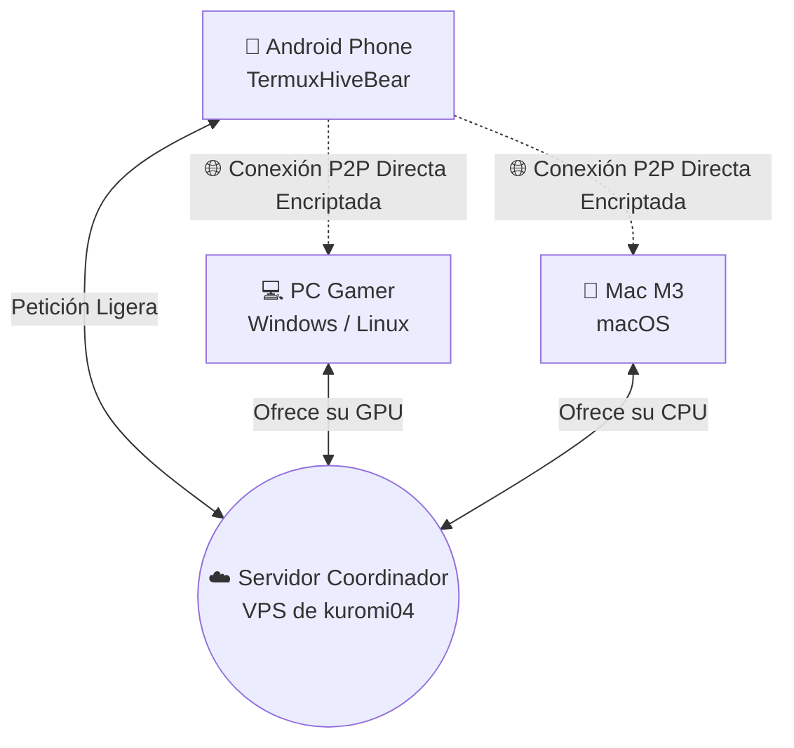

# 🧠 Cómo Funciona HiveBear: La Magia P2P Explicada
*(English version below / Versión en inglés abajo)*

Bienvenido a la guía visual de **HiveBear**, parcheado y mejorado por [@kuromi04](https://github.com/kuromi04). Si no eres un experto en redes o Inteligencia Artificial, ¡no te preocupes! Aquí te explicamos cómo logramos conectar computadoras y celulares de todo el mundo.

---

## 🧩 1. ¿Qué es una red P2P de Inteligencia Artificial?

Imagina que un modelo de IA moderno (como Llama 3 70B) es un **rompecabezas gigante de 70,000 piezas**. 
Si intentas armarlo tú solo en tu teléfono celular, el teléfono se quedará sin memoria, se calentará y la batería morirá.

**La Solución P2P (Peer-to-Peer):**
En lugar de depender de una supercomputadora central de una corporación (como hace ChatGPT), HiveBear conecta tu celular con las computadoras de 10 amigos. Cada computadora procesa 7,000 piezas del rompecabezas en milisegundos y le pasa el resultado a tu teléfono. 

> [!TIP]
> **Resultado:** ¡Tu teléfono Android obtiene respuestas de una IA superinteligente de forma instantánea sin gastar sus propios recursos!

---

## 📱 2. El Ecosistema de @kuromi04 (Termux + PC)

Esta edición especial conecta dos mundos que antes estaban separados:

1. **Tu PC (Windows/Linux/Mac):** Funciona como el "músculo". Descarga el modelo de IA pesado y lo carga en su Tarjeta Gráfica.
2. **Tu Teléfono (Android con Termux):** Funciona como el "cerebro ágil". Te permite chatear desde cualquier lugar usando la potencia de las PCs conectadas a la red.

---

## 🕵️‍♂️ 3. Seguridad y Privacidad: ¿Me pueden hackear?

¡NO! Tus amigos hackers éticos estarán felices de saber cómo hemos protegido el código:

* **Cifrado de Extremo a Extremo (QUIC / TLS):** Toda la comunicación entre tu celular y la PC viaja encriptada. Ni siquiera tu proveedor de internet puede leer lo que estás hablando con la IA.
* **Aislamiento Total (Sandboxing matemático):** Cuando te conectas a la PC de un extraño, el protocolo de HiveBear **solo** entiende matemáticas de matrices (tensores). Es criptográficamente imposible que alguien acceda a los archivos de tu disco duro, mire tus fotos o tome control de tu PC.
* **Protección contra DoS (Denegación de Servicio):** El servidor coordinador ha sido parcheado por `@kuromi04` para bloquear el spam de conexiones falsas. Si un bot intenta atacar la red, el sistema lo ignora automáticamente (máximo 50 señales por cola y limpieza de memoria en tiempo real).

---

## 📡 4. Los Protocolos: ¿Cómo se encuentran los dispositivos?

Si tú estás en México y tu amigo en Ucrania, ¿cómo se conectan sin abrir puertos en el router? Usamos una mezcla de protocolos avanzados:

1. **mDNS (Multicast DNS):** Si tú y tu amigo están en la misma casa (mismo WiFi), HiveBear los conecta instantáneamente sin usar internet, encontrándose como por "Bluetooth".
2. **STUN y Hole Punching:** Si están en diferentes países, nuestro **Servidor Coordinador** hace de "Cupido". Les dice a ambos routers: *"Oigan, estos dos se conocen, abran un túnel"*. Los routers perforan sus propios cortafuegos (Hole Punching) de forma segura, permitiendo que hablen directo.
3. **WebRTC / QUIC:** Una vez conectados, los datos viajan por un protocolo diseñado para videollamadas y juegos de alta velocidad. Si el internet falla por un segundo, la red se repara sola y sigue transmitiendo.

---
---

# 🧠 How HiveBear Works: P2P Magic Explained (English)

Welcome to the visual guide for **HiveBear**, patched and enhanced by [@kuromi04](https://github.com/kuromi04). If you're not a network or AI expert, don't worry! Here we explain how we managed to connect computers and phones around the world.

## 🧩 1. What is an AI P2P Network?
Imagine a modern AI model is a **giant 70,000-piece puzzle**. If you try to build it on your phone, it will crash and burn.
**The P2P Solution:** Instead of relying on a centralized corporate supercomputer, HiveBear connects your phone to 10 friends' PCs. Each PC processes 7,000 pieces in milliseconds and sends the result back to your phone. You get super-smart AI locally, without burning your phone's battery!

## 📱 2. The @kuromi04 Ecosystem (Termux + PC)
This special edition connects two previously separate worlds: 
* **Your Desktop (Windows/Mac/Linux):** The "muscle". It loads the heavy AI model onto its GPU.
* **Your Android (TermuxHiveBear):** The agile client. Chat from anywhere using the distributed power of the mesh network.

## 🕵️‍♂️ 3. Security & Privacy: Can I be hacked?
**NO!** Ethical hackers will love our security patches:
* **End-to-End Encryption:** All data travels via military-grade TLS/QUIC.
* **Math Sandboxing:** The protocol *only* understands tensor mathematics. It is impossible for a peer to access your hard drive or personal files.
* **Anti-DoS Protection:** The signaling server has been hardened by `@kuromi04` to prevent memory leaks and drop spam connections (max 50 signals per node).

## 📡 4. The Protocols under the hood
* **mDNS:** Instant auto-discovery if you are on the same WiFi.
* **STUN / Hole Punching:** Our Coordinator Server acts as a matchmaker, tricking strict NAT routers into opening a direct, secure tunnel between different countries without manual port forwarding.
* **QUIC:** Ultra-fast, fault-tolerant streaming protocol for the AI tensors.
